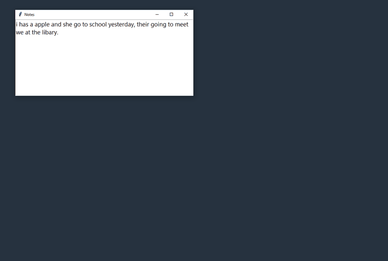
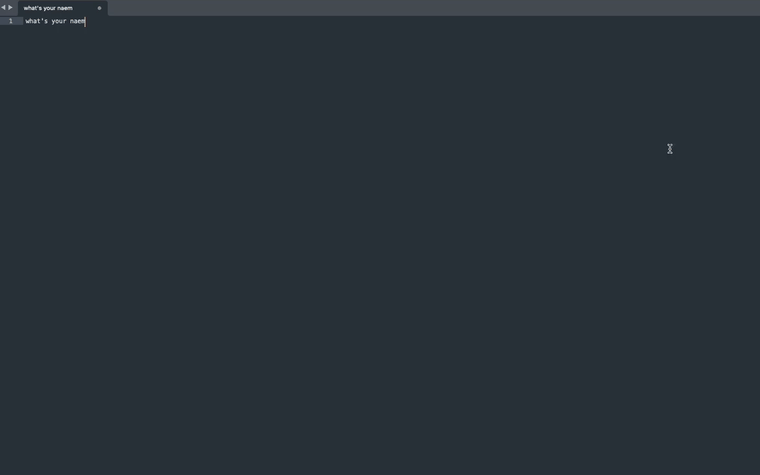
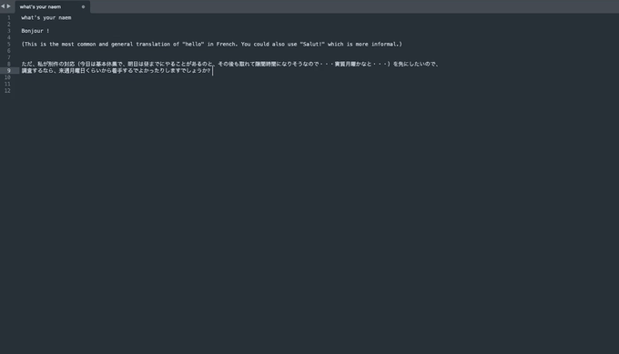
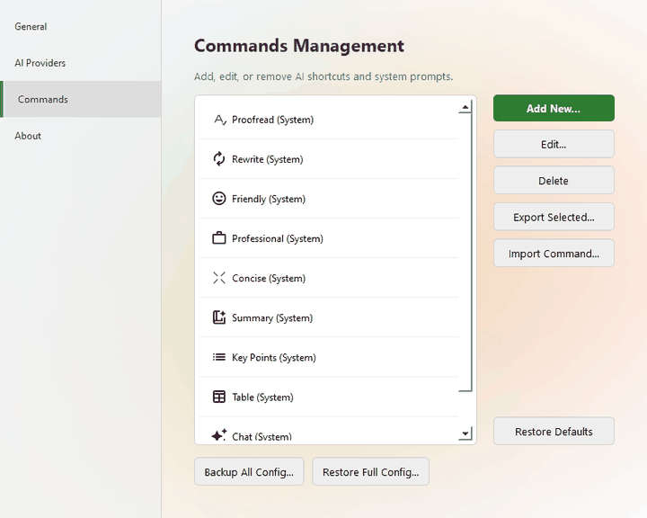
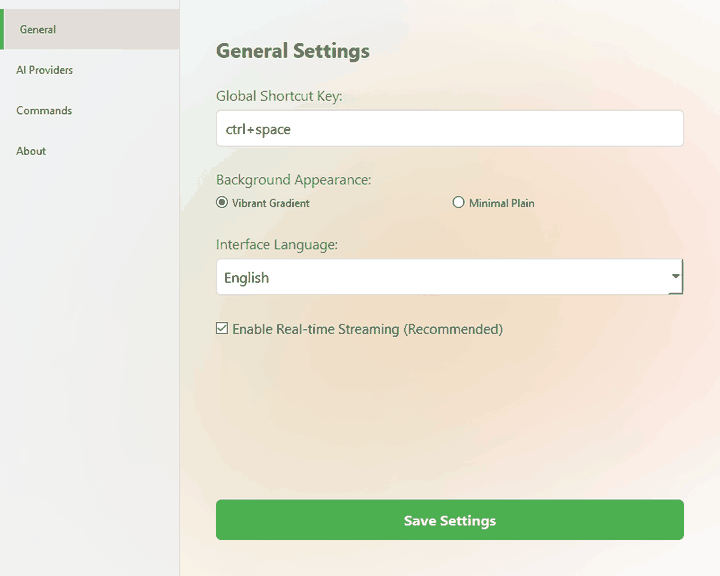
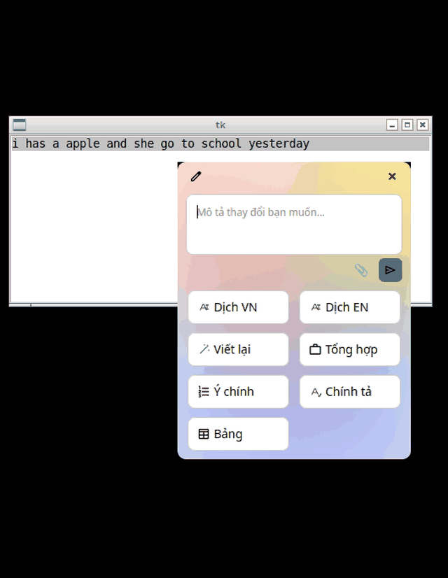

# AI Shortcuts — Writing Tools

**Select text in any app, press a hotkey, and let AI fix, rewrite or summarize it in place.**

A fork of [WritingTools](https://github.com/theJayTea/WritingTools) by theJayTea, maintained by [Nam Trần](https://github.com/gemkids275). Native on **macOS**, with pre-built binaries for **Windows** and **Linux**.

[](https://aishortcuts.github.io/)
[](https://ko-fi.com/gemkids)

<p align="center">
  
  
</p>

## Contents

- [Why AI Shortcuts](#why-ai-shortcuts)
- [Features by platform](#features-by-platform)
- [How to use](#how-to-use)
- [What's new in this fork](#whats-new-in-this-fork)
- [AI providers](#ai-providers)
- [Installation](#installation)
- [Common issues](#common-issues)
- [Privacy](#privacy)
- [Support the project](#support-the-project)
- [Credits](#credits) · [About the author](#about-the-author) · [License](#license)

## Why AI Shortcuts

- **One hotkey, any app.** Select text, press the shortcut, pick a command. No copy-paste into a chat tab.
- **Your commands.** Proofread, Rewrite, Summary, or any prompt you write. Reorder, back up and share them.
- **Your model.** Cloud or local, with a different provider or model per command.
- **Private by design.** No telemetry. Text only goes to the provider you chose.

## Features by platform

| Feature | macOS | Windows | Linux |
|---|:---:|:---:|:---:|
| Built-in commands (Proofread, Rewrite, Friendly, Professional, Concise, Summary, Key Points, Table) | ✅ | ✅ | ✅ |
| Custom instruction and chat mode (no selection needed) | ✅ | ✅ | ✅ |
| Image and text-file attachments, follow-up questions | ✅ | ✅ | ✅ |
| Command Manager: custom commands, drag-to-reorder, import/export, backup | ✅ | ✅ | ✅ |
| Per-command shortcut and AI provider | ✅ | ✅ | ✅ |
| Streaming responses, zoomable response window | ✅ | ✅ | ✅ |
| Interface languages | 7 | 5 | 5 |
| Local models: Ollama and OpenAI-compatible servers | ✅ | ✅ | ✅ |
| On-device MLX models (Apple Silicon) | ✅ | — | — |
| RTF-preserving Proofread | ✅ | — | — |
| Global hotkeys | ✅ | ✅ | X11 only |

Windows and Linux languages: English, Tiếng Việt, Italiano, 日本語, 简体中文.

## How to use

### Fix or improve selected text

1. Select text in any app.
2. Press your hotkey (macOS `⌥ Space`, Windows/Linux `Ctrl+Space`).
3. Pick a command: **Proofread**, **Rewrite**, **Friendly**, **Professional**, **Concise**, **Summary**, **Key Points** or **Table**.
4. The result replaces your text (undo with `⌘Z` / `Ctrl+Z`) or opens in a response window you can keep chatting in.

<p align="center"></p>

### Custom instruction

Select text (or select nothing for chat mode), press the hotkey and type what you want, such as _"translate to French"_ or _"make it a bullet list"_. **Enter** sends, **Shift+Enter** adds a new line.

<p align="center"></p>

### Attach images or files

Paste an image (`⌘V` / `Ctrl+V`) or click the paperclip to add an image or a text file. The AI sees both your instruction and the attachment, in the first prompt and in follow-ups.

<p align="center"></p>

### Summarize a page or video

Select everything on a page (`⌘A` / `Ctrl+A`), press the hotkey and choose **Summary**, **Key Points** or **Table**. For YouTube, open **Show transcript**, copy it, paste it anywhere, then select and run the command.

### Manage your commands

Open **Settings → Commands** to add, edit, reorder, export and import commands, back up your whole setup, or restore the built-ins.

<p align="center"></p>

### Switch the interface language

Pick a language in **Settings → General** and save.

<p align="center"></p>

### Linux

The Linux build runs on X11 desktops with the same hotkey, popup and response window.

<p align="center"></p>

## What's new in this fork

**Windows & Linux — first release (`win-v1`)**
- New **Command Manager**, per-command shortcuts with conflict detection, and per-command AI overrides.
- **Attachments** in prompts and follow-ups; a redesigned settings, popup and response window.
- **Anthropic, Mistral and OpenRouter** join Gemini, OpenAI-compatible and Ollama.
- **Five interface languages**, applied from Settings.
- **Pre-built binaries** with SHA-256 checksums and build provenance, plus CI on every pull request. See the [changelog](Windows_and_Linux/CHANGELOG.md).

**macOS**
- Image and text attachments, multi-line input, and a popup that can be dragged across screens.
- Command import/export, full backup and restore, and drag-to-reorder.
- Per-command providers and in-app language switching.
- Fixed the onboarding deep link to **Privacy & Security** on recent macOS versions.

## AI providers

| Provider | Type | macOS | Windows / Linux |
|---|---|:---:|:---:|
| Google Gemini | Cloud, free tier | ✅ | ✅ |
| OpenAI and compatible APIs | Cloud / local | ✅ | ✅ |
| Anthropic Claude | Cloud | ✅ | ✅ |
| Mistral AI | Cloud | ✅ | ✅ |
| OpenRouter (100+ models) | Cloud | ✅ | ✅ |
| Ollama, LM Studio, llama.cpp | Local | ✅ | ✅ |
| MLX on Apple Silicon | On-device | ✅ | — |

Mix and match: cloud models for hard tasks, local models for private or offline work.

## Installation

Visit the [website](https://aishortcuts.github.io/) or grab the latest build from the [Releases page](https://github.com/gemkids275/AIShortcuts/releases). macOS uses `v*` tags; Windows and Linux use `win-v*` tags.

### macOS

Requires macOS 14 (Sonoma) or later. Download the `.dmg`, drag the app to **Applications** and launch it. The first run guides you through **Accessibility** and **Screen Recording** permissions (manage them in **System Settings → Privacy & Security**).

### Windows

Download `AI-Shortcuts-windows-x64.exe` and run it. The binary is not code-signed, so SmartScreen may warn once: choose **More info → Run anyway**, or verify the checksum first. Settings live in `%APPDATA%\AIShortcuts`.

### Linux

```bash
tar -xzf AI-Shortcuts-linux-x64.tar.gz
./"AI Shortcuts"
```

Needs an **X11** session and `xclip` or `xsel`. Global hotkeys do not work on Wayland. Settings live in `~/.config/aishortcuts`.

### Verify your download

```bash
sha256sum -c SHA256SUMS.txt --ignore-missing
gh attestation verify <file> --repo gemkids275/AIShortcuts
```

### Run from source (Windows & Linux)

```bash
cd Windows_and_Linux
pip install -r requirements.txt
python main.py
```

<details>
<summary>Release process (maintainers)</summary>

Run `python Windows_and_Linux/bump_version.py <N>`, add a `## [<N>]` entry to `Windows_and_Linux/CHANGELOG.md` and a `Windows_and_Linux/release-notes/win-v<N>.md`, merge through a pull request (CI must pass), then push the tag `win-v<N>`. The release workflow builds both platforms and publishes checksums and provenance attestations. To refresh the assets of an existing release, run the **Release Windows & Linux** workflow manually with `release_tag` set to that tag.

</details>

## Common issues

**macOS: only the input box shows, no command buttons.** AI Shortcuts needs Accessibility access to read your selection. Open **System Settings → Privacy & Security → Accessibility** and turn **AI Shortcuts** on. If it is already on, remove it with **−**, relaunch the app and grant the permission again. An older entry such as "WritingTools" must be removed first.

**Windows: the tray menu does not open.** After an app is force-closed, Windows can leave a stale icon in the hidden-icons flyout. Hover over the leftover icons to clear them, then right-click the current one.

**Linux: hotkeys or paste do nothing.** Use an X11 session and install `xclip` or `xsel`. Wayland blocks global hotkeys and simulated keystrokes.

## Privacy

- **No telemetry, no analytics, no ads.**
- Text is sent only to the AI provider you configure, only when you trigger a command.
- API keys are stored in the macOS Keychain, or in the OS keyring on Windows and Linux. Without a keyring, per-command keys fall back to a lightly obfuscated local file, not encrypted storage.
- Use Ollama, MLX or another local model to keep everything on your device.

## Support the project

AI Shortcuts is free, open-source, and built in my spare time without subscriptions. If you find it helpful, starring the project, reporting bugs, or buying a coffee helps keep it going.

[☕ Buy me a coffee on Ko-fi](https://ko-fi.com/gemkids)

## Credits

Built on **[WritingTools](https://github.com/theJayTea/WritingTools)** by **[Jesai](https://github.com/theJayTea)**, featured in [28+ publications](https://github.com/theJayTea/WritingTools/blob/main/Media%20Coverage.md) and among the [top trending AI projects on GitHub](https://devface.ai/ranking/top_ai_developers/2024-10) in October 2024. The native macOS port was built from scratch by **[Arya Mirsepasi](https://github.com/Aryamirsepasi)**.

Contributors to the original project: **[momokrono](https://github.com/momokrono)** (Linux, pynput, Ollama, localization), **[Cameron Redmore](https://github.com/CameronRedmore)** (OpenAI-compatible API, streaming, chat mode), **[Joaov41](https://github.com/Joaov41)** (images in Gemini on macOS), **[gdmka](https://github.com/gdmka)** (per-command provider, zoom memory), **[drankush](https://github.com/drankush)** (custom Base URL fix). Full list: [theJayTea/WritingTools](https://github.com/theJayTea/WritingTools#-contributors).

## About the author

**Nam Trần** is a web developer in Vietnam. This fork started as a personal tool, built in spare time to fit the way they work, and is shared free of charge in the spirit of the original project.

Found a bug or have an idea? [Open an issue](https://github.com/gemkids275/AIShortcuts/issues). If it saves you time, a ⭐ on GitHub is the best thank-you.

**Copyright or legal concerns:** email **gemkids275@gmail.com** and the matter will be reviewed promptly.

## License

Distributed under the **GNU General Public License v3.0**, the same as the original project. See [LICENSE](LICENSE).
